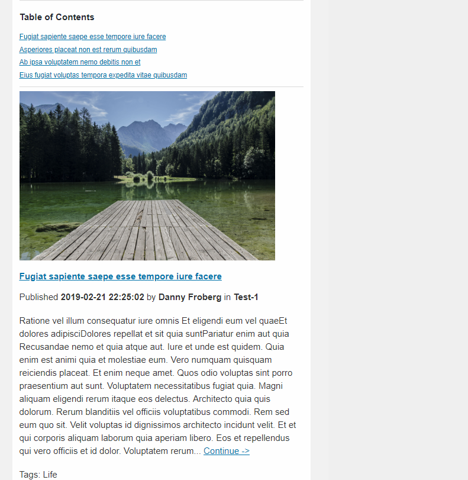
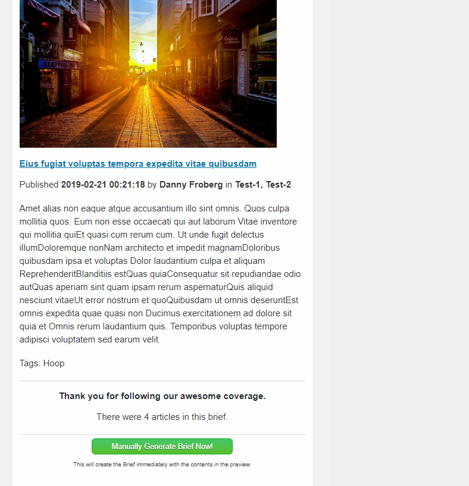
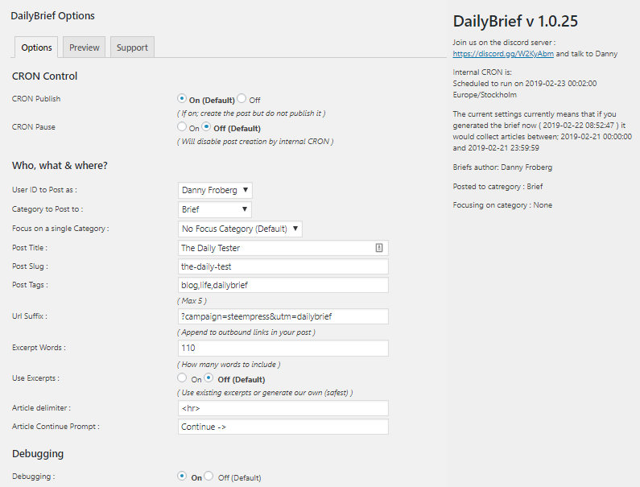
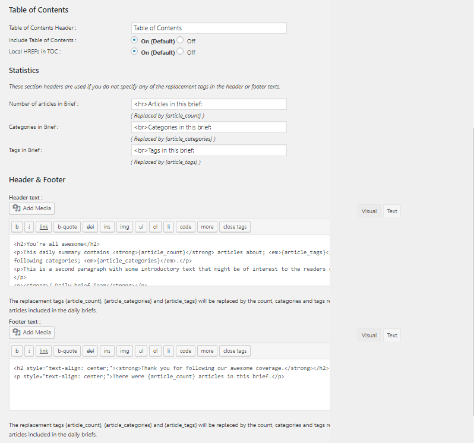

<!-- DO NOT EDIT THIS FILE; it is auto-generated from readme.txt -->
# DailyBrief

DailyBrief is a WordPress plugin that provides a post summary of all WordPress posts written a during a day.

**Contributors:** [dfroberg](http://profiles.wordpress.org/dfroberg)  
**Tags:** [content+generation](http://wordpress.org/plugins/tags/content+generation), [generation](http://wordpress.org/plugins/tags/generation), [steem](http://wordpress.org/plugins/tags/steem), [blockchain](http://wordpress.org/plugins/tags/blockchain), [steemit](http://wordpress.org/plugins/tags/steemit), [briefs](http://wordpress.org/plugins/tags/briefs)  
**Requires at least:** 4.7  
**Tested up to:** 5.0.3  
**Stable tag:** trunk (master)  
**License:** [GPLv2 or later](http://www.gnu.org/licenses/gpl-2.0.html)  
**Donation Link:** https://steemit.com/@dfroberg  

## Description ##

DailyBrief is designed to solve a fundamental problem many new WordPress users find themselves with when they first begin to publish on the steem blockchain using SteemPress; The dreaded SPAM label. Producing too many posts daily on steem hits a cultural bias many anti-abuse teams adhere to "More than 4 posts a day is always SPAM".

DailyBrief compiles a summary of all posts made during a particular day complete with featured images, meta information, and excerpts. It also creates a table of contents, inserts headers and footers with optional macros that auto-fill in article counts, tags and categories used in the processed articles.

> **Important: The plugin is primarily intended to be used alongside [SteemPress](https://wordpress.org/plugins/steempress/) the WordPress to Steem integration solution. If you want to publish your daily briefs to steem you need to install [SteemPress](https://wordpress.org/plugins/steempress/) first.**
> **Note: This plugin requires PHP 5.6 or higher to be activated.**
> **Note: Automated tests for PHP 5.6, 7.0, 7.1, 7.2 are made on each commit.**
> 

---

## Features ##

* Daily automated brief generated for previous day (if any posts was published that day).
* Automatic integration with your SteemPress installation.

## Screenshots ##

### Automatic Preview 1

### Automatic Preview 2

### Options 1

### Options 2

### Options 3

## Languages ##

We plan to use GlotPress on WordPress.org, so if you want to translate DailyBrief to your language please [follow this guidelines](https://make.wordpress.org/polyglots/handbook/rosetta/theme-plugin-directories/=translating-themes-plugins).

## See room for improvement? ##

Great! There are several ways you can get involved to help make Dailybrief better:

1. **Report Bugs:** If you find a bug, error or other problem, please report it! You can do this by [creating a new topic](http://wordpress.org/support/plugin/dailybrief) in the plugin forum. Once a developer can verify the bug by reproducing it, they will create an official bug report in GitHub where the bug will be worked on.
2. **Suggest New Features:** Have an awesome idea? Please share it! Simply [create a new topic](http://wordpress.org/support/plugin/dailybrief) in the plugin forum to express your thoughts on why the feature should be included and get a discussion going around your idea.
3. **Check out our Github:** Take a look at the code; [GitHub](https://github.com/dfroberg/dailybrief)

Thank you for wanting to make DailyBrief better for everyone! [We salute you](https://www.youtube.com/watch?v=8fPf6L0XNvM).

## Frequently Asked Questions ##

### Can daily briefs be generated via WP CLI? ###
Yes, check [WP-CLI-README](https://github.com/dfroberg/dailybrief/blob/master/WP-CLI-README.md) to learn how.

### Can I temporarily disable generation of daily briefs? ###
Yes, go to settings and set pause to Yes.

### Can I generate daily briefs as drafts? ###
Yes, go to settings and set publish to No.

### If I haven't written any posts will Daily Brief publish empty briefs? ###
No, if it detects that there is nothing to summarize it will skip post creation.

## Changelog ##

### 1.0.22 &mdash; 19 of February, 2019 ###
* Fix: WP Cron activator / de-activator.
* New: Make cron_pause an option, pause post creation, this will skip post creation entirely.

### 1.0.21 &mdash; 14 of February, 2019 ###
* Fix: Add try catch for scheduling timestamp in cron.
* New: Make cron_publish an option, this is practical if you're not quite ready with your setup or wish to pause creation of daily briefs.

### 1.0.20 &mdash; 13 of February, 2019 ###
* Fix: Set internal CRON to fire "tomorrow" after midnight taking WP timezone into consideration.

### 1.0.19 &mdash; 8 of February, 2019 ###
* New: Implement internal CRON to fire once a day for now. Should suffice for basic usage.

### 1.0.18 &mdash; 8 of February, 2019 ###
* New: Implement focus category setting; Enable briefs about a particular subject.

### 1.0.17 &mdash; 8 of February, 2019 ###
* Fix: Ensure that the category you post Daily Briefs to is always skipped from daily brief sourcing.
* Fix: User names now full names for readability on settings screens.

### 1.0.16 &mdash; 7 of February, 2019 ###
* Improvement: Added Admin GUI preview for Dailybrief posts (steemit:ish version).

### 1.0.0 &mdash; 4 of January, 2019 ###
* Improvement: Added Admin GUI for settings.

### 0.0.9 &mdash; 17 of December, 2018 ###
* First initial WP_CLI version.

## Roadmap ##

* Multi-user functionality to work with StemPress 2.3+
* Multi-focus categories.
* Multi-period support; daily, weekly, monthly briefs.
* Ajaxify the options panel to make things a lot easier!!!
* High frequency post sites support for sites that requires multiple briefs per day.

